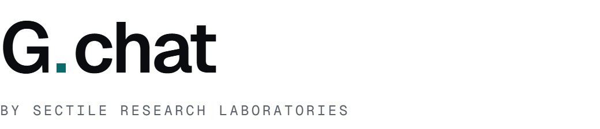
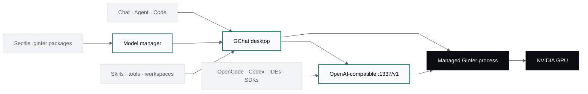

# GChat

<p align="center">
  <picture>
    <source media="(prefers-color-scheme: dark)" srcset="assets/gchat-lockup-reversed.png">
    <source media="(prefers-color-scheme: light)" srcset="assets/gchat-lockup.png">
    
  </picture>
</p>

<p align="center">
  <strong>The local desktop workspace for GInfer chat, agents, tools, and coding.</strong>
</p>

<p align="center">
  <a href="https://sectilelabs.ai"></a>
  
  
  
  
  <a href="LICENSE"></a>
</p>

<p align="center">
  <a href="#at-a-glance">Scope</a> ·
  <a href="#architecture">Architecture</a> ·
  <a href="#agent-workflows">Agents</a> ·
  <a href="#code-with-local-models">Code</a> ·
  <a href="#local-api">Local API</a> ·
  <a href="#quick-start">Quick start</a> ·
  <a href="#release-status">Releases</a> ·
  <a href="#about-sectile-research-laboratories">About</a>
</p>

---

GChat is the desktop client we are building at Sectile Research Laboratories around
[GInfer](https://github.com/Gadflyii/ginfer). It owns model acquisition, engine lifecycle,
conversations, tool calling, agent workflows, coding-agent integration, and the local API surface.
GInfer remains the single local inference backend.

The first Sectile release is in development. The current tree already contains the managed GInfer
runtime, chat and tool surfaces, the autonomous Rust agent, skills and workspace controls, model
downloads, external coding-agent setup, and `gchat-cli`. The embedded Code workspace, visual loop
builder, dispatcher, Windows GInfer integration, and matched installers are still being completed.

## At a glance

| | GChat release scope |
| --- | --- |
| **Desktop** | Tauri 2 shell with a React interface |
| **Inference** | GInfer only; one resident `.ginfer` model behind the application |
| **Conversations** | Streaming chat, reasoning, vision where the model permits it, tool calling, artifacts, projects |
| **Agents** | Bounded autonomous loop, skills, local workspace, approvals, attachments, tools, cancellation |
| **Coding** | External coding-agent configuration and `gchat-cli` today; embedded OpenCode terminal in development |
| **Local API** | OpenAI-compatible facade at `http://127.0.0.1:1337/v1` |
| **Models** | Curated version-3 `.ginfer` packages with install and local lifecycle management |
| **Release targets** | Windows 10/11 x64 and Linux x86-64; first matched installers are in development |
| **Hardware** | NVIDIA CUDA, with GInfer packages admitted by model, storage profile, SM image, and topology |
| **Data** | Conversations, settings, model state, and workspaces remain local by default |

## Architecture



The desktop application and command-line client share the same GChat data root. A model downloaded
through the UI is available to `gchat-cli`; engine ownership and process state stay explicit so two
frontends do not silently load competing copies of the same model.

## Desktop experience

### Managed GInfer

GChat probes the host before exposing local inference, installs and drives the GInfer extension,
starts `ginfer-serve`, waits for readiness, and presents model load failures as product state. The
application does not contain a llama.cpp, MLX, or generic fallback route. A host outside the current
NVIDIA/CUDA contract receives a clear unsupported state instead of falling through to a different
engine.

### Model manager

The model pipeline is limited to curated `.ginfer` packages. GChat owns catalog presentation,
download progress, pause and resume, storage, installation state, and local lifecycle. GInfer owns
artifact validation and execution; the desktop client does not quantize, split, or repack weights.

### Chat and tools

Regular conversations stream through the same local engine used by the API and agent surfaces.
GChat preserves reasoning content, supports image input on qualified model routes, renders tool
activity, manages MCP connections, and provides artifact previews for generated HTML and code.

## Agent workflows

The in-process agent is a separate bounded execution route with a grammar-constrained tool
protocol. Agent Studio builds reusable Standard Agents, evaluator-driven Goal Loops, bounded
Coordinator Teams, and acyclic Workflows over that same executor. It maintains per-thread and
isolated stage workspaces, streams activity over Tauri IPC, records a bounded run trace, and stops
on reply, finish, cancellation, failure, breaker, or the configured step limit.

Current tool families include:

- filesystem reads, writes, edits, diffs, archives, and trash;
- Git inspection;
- guarded shell and process operations;
- HTTP, web search, and page extraction;
- clipboard and desktop notifications;
- vision description when the active GInfer model is vision-capable;
- skill discovery and execution.

Mutating or stateful work is serialized, pure reads may run concurrently, and dangerous operations
pass through path confinement, shell guards, and approval policy. Parallel team members and
workflow branches use isolated writable workspaces with read-only source access; a shared-workspace
stage must occupy its graph level alone. Skills can be assigned to the complete
definition or to individual roles.

## Code with local models

GChat can detect, install, configure, and launch external coding agents against the local API.
OpenCode, Codex, Claude Code, Cline, Goose, OpenHands, Kilo Code, and other supported clients share
the model already managed by GChat rather than starting a second inference backend.

The Code tab is in development. It will embed a persistent PTY running the real OpenCode TUI, so
navigation does not terminate the coding session and GChat does not reimplement an upstream agent
interface. Until that surface lands, the Launch page and `gchat-cli launch` provide the supported
entry points.

```bash
gchat-cli models list
gchat-cli launch opencode
```

## Local API

The desktop facade listens on loopback by default:

```bash
curl http://127.0.0.1:1337/v1/chat/completions \
  -H 'content-type: application/json' \
  -d '{
    "model": "<loaded-ginfer-model>",
    "messages": [{"role": "user", "content": "Summarize the active task."}]
  }'
```

OpenAI-compatible SDKs use the same endpoint:

```python
from openai import OpenAI

client = OpenAI(base_url="http://127.0.0.1:1337/v1", api_key="gchat")
response = client.chat.completions.create(
    model="<loaded-ginfer-model>",
    messages=[{"role": "user", "content": "Draft a test plan."}],
)
print(response.choices[0].message.content)
```

The server stays bound to `127.0.0.1` unless the user explicitly enables LAN access. Standard
OpenAI request and streaming behavior is treated as an external compatibility contract.

## Command-line client

`gchat-cli` uses the same model directory and engine integration as the desktop application.

```bash
# List installed chat packages.
gchat-cli models list

# Load a model and expose it through a standalone local endpoint.
gchat-cli serve <model-id>

# Load a model, configure a supported coding agent, and launch it.
gchat-cli launch opencode

# Inspect the desktop application's local API server.
gchat-cli server status
```

Standalone `gchat-cli serve` defaults to port `6767`; the desktop facade defaults to port `1337`.

## Quick start

### Development prerequisites

- Node.js 20 or newer;
- Yarn 4.5.3;
- Rust and the Tauri 2 platform prerequisites;
- GNU Make;
- a supported NVIDIA/CUDA host for live GInfer inference.

The deterministic frontend and Rust checks do not require a model.

### Build and run

```bash
git clone https://github.com/sectilelabs/gchat.git
cd gchat

make dev
```

After the first setup, `yarn dev` runs the normal hot loop.

### Verify

```bash
make verify-fast
make verify
```

`make verify-fast` runs lint, TypeScript checks, quality guards, Vitest, and the critical coverage
floors. `make verify` adds every Rust suite supported by the current platform.

## Release status

The first Sectile distribution is being prepared as a matched set:

| Channel | Release deliverable |
| --- | --- |
| **Windows** | Native Windows 10/11 x64 installer with GChat, GInfer, local server, CLI, and model manager |
| **Linux** | Native x86-64 AppImage with the same managed engine and application surfaces |
| **GInfer packages** | Architecture-specific engine builds matched to the supported NVIDIA SM families |
| **Model packages** | Version-3 `.ginfer` artifacts distributed separately from the application |

Windows remains gated until the native GInfer port and its packaged lifecycle pass the release
matrix. Linux is the current development host. Installer links will appear when the complete
application, engine, and model contract is ready; the README does not present placeholder downloads
as released assets.

## Data and security

- The local API is loopback-only by default.
- Conversations, settings, agent sessions, and workspaces are stored under the GChat data root.
- Model packages live under `<data>/ginfer/models/`.
- Agent paths are canonicalized and confined to the active workspace unless a scoped approval
  allows the exact outside operation.
- Shell commands pass through allow, approval-required, or hard-block policy before execution.
- Attachments are staged into bounded turn-local storage; source paths and base64 payloads are not
  retained in the durable transcript.

## Product boundaries

GChat owns the desktop experience, application server facade, model discovery and downloads,
conversations, tools, agents, coding integrations, and local workflow state. GInfer owns model
loading, K/V state, scheduling, CUDA execution, speculative decoding, and protocol serving.
Quantization, calibration, conversion, TP partitioning, and model-package production remain outside
the desktop application.

## Documentation

- [Development workflow](DEVELOP.md)
- [Contributing](CONTRIBUTING.md)
- [Engineering decisions](docs/decisions/INDEX.md)
- [Agent architecture](src-tauri/src/core/agent/ARCHITECTURE.md)
- [GInfer serving contract](https://github.com/Gadflyii/ginfer/blob/main/docs/serving.md)

## About Sectile Research Laboratories

Sectile Research Laboratories develops and licenses AI technology. The work spans a model
architecture, training platform, inference engine, agent harness, and middleware for rules,
routing, logging, and compliance. GChat is the local user and agent workspace for that stack.

Sectile is not an AI service provider. Commercial engagement is through architecture licensing,
joint development, and professional services.

- Web: [sectilelabs.ai](https://sectilelabs.ai)
- Partnerships: [partners@sectilelabs.ai](mailto:partners@sectilelabs.ai)

## License

GChat is available under the [Apache License 2.0](LICENSE).

## Upstream acknowledgement

GChat began as a fork of [Atomic Chat](https://github.com/AtomicBot-ai/Atomic-Chat), which is a hard
fork of [Jan](https://github.com/janhq/jan). We thank both projects and their contributors for the
desktop foundation.

---

<p align="center">
  <a href="https://sectilelabs.ai">
    <picture>
      <source media="(prefers-color-scheme: dark)" srcset="assets/sectile-lockup-reversed.png">
      <source media="(prefers-color-scheme: light)" srcset="assets/sectile-lockup.png">
      
    </picture>
  </a>
</p>

<p align="center">
  <sub>Built and maintained by <a href="https://sectilelabs.ai">Sectile Research Laboratories</a> · <a href="https://sectilelabs.ai">sectilelabs.ai</a></sub>
</p>
