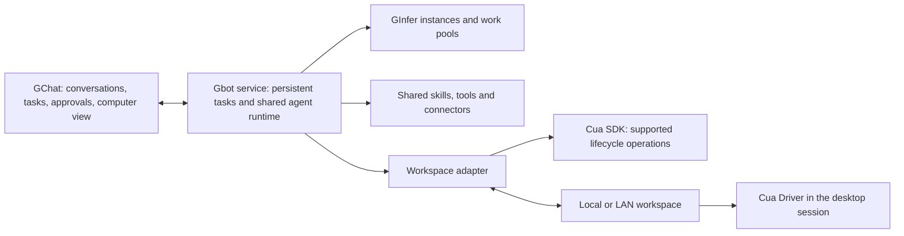

# Gbot design draft

Gbot is a persistent assistant feature to be embedded in GChat and also included
in the paid Arbitor product. That product placement is confirmed; the runtime
and workspace design below remains proposed. Gbot would retain
its identity, conversations, tasks and working memory, use the shared agent
runtime, and operate a computer workspace on a local machine or LAN host within
GChat's current scope. Closing the GChat window would leave the service and its
work running. Earlier cloud possibilities are retained below without a product
assignment or support claim.

Status: initial design, October 10, 2026. The requested deliverable is this draft;
implementation, dependency installation and VM provisioning are outside this
step. Cua's SDK and Driver are the proposed foundation. Provider support and
dependency versions remain to be selected.

## Product placement

GChat is the open release: its front end, lightweight infrastructure management,
LAN-only operation, agent builder and support, prebuilt skills and integrations,
and embedded Gbot feature form the base product. Arbitor is a paid product built
on GChat, adding security, logging, cost management, rules engines and related
paid layers. All GChat work carries into Arbitor; paid features do not belong in
GChat.

The persistent service is an execution component of the feature, not a decision
to ship a separate Gbot application.

Those product categories are confirmed. Exact pricing, license, distribution,
limits and feature details remain unspecified. Cua component license review
remains a separate adoption requirement.

GInfer OI-145 CPU inference is separate work. This Gbot draft neither selects
its implementation nor makes CPU inference a prerequisite for computer control;
inference assignments and computer workspaces remain distinct.

## Design direction

| Area | Current direction | Status |
| --- | --- | --- |
| Product placement | GChat open base with embedded Gbot; paid Arbitor builds on all GChat work and adds its paid layers. | Confirmed; exact terms and details remain open |
| Agent capabilities | Reuse GChat's agent definitions, skills, tools, connectors and inference work pools. | Proposed; follows the user's shared-runtime direction |
| Computer workspace | Attach a local/LAN VM or provision one where the selected local/LAN provider supports it. | GChat scope; provider choice pending |
| Computer control | Use Cua Driver for capture and input; use Cua SDK for supported lifecycle operations. | Proposed foundation |
| Persistent execution | Run the coordinator as a service independently of the GChat desktop process. | Proposed |
| Initial connection | Local/LAN Linux workspace with SSH carrying remote MCP and command/file access. | Proposed first integration |
| Other environments | Local/LAN Windows guests require session and connection qualification; cloud VMs and Windows 365 have no product assignment. | Historical cloud candidates are outside current GChat LAN scope |

The design is ready for discussion when it explains the service boundaries,
workspace requirements, SSH's role, persistence, control ownership and open
decisions. The next unresolved choice is the first workspace environment and
whether its desktop is supplied by a Cua image or an existing guest installation.

## Architecture

The Gbot service owns execution and durable state. GChat is its client. A small
adapter translates the existing capability executor's calls into operations on
the selected workspace. Cua supplies the computer mechanics; Gbot supplies task
semantics, permissions, scheduling, memory and presentation.

Keep the GChat base clean, with explicit extension points at the shared runtime,
workspace and infrastructure-management boundaries for Arbitor's paid layers.
Arbitor reuses the base contracts and behavior; its security, logging, cost and
rules implementations remain outside GChat. The extension interfaces and paid
feature details still require design; no plugin mechanism or code is selected
by this draft.

Inference stays separate from computer execution. A workspace can use a ready
GInfer instance on the LAN; it does not require a local inference GPU. Desktop
capture and input alone do not establish that an assigned model can interpret
images, plan reliable GUI actions or satisfy the task. Reasoning directly over
screenshots requires an appropriate model and a ready Vision route; control
through text or accessibility information can use a suitable text model.

The current [agent architecture](../../src-tauri/src/core/agent/ARCHITECTURE.md)
already shares capability policy across Chat, Studio and Code, but app exit
requests cancellation. Moving execution ownership to a service is an actual
runtime change. A VM connection alone does not provide unattended Gbot operation.
The existing [agent runtime record](../agent-runtime/README.md) retains current
implementation and acceptance status.

## Computer workspace requirements

Provisioning a VM is a relatively direct part of the design. A usable computer
workspace also needs a persistent disk, its intended applications, a desktop
session when visual control is required, and a working control connection.

| Capability | Required behavior |
| --- | --- |
| Identity and readiness | Report the exact workspace and available shell, file and desktop capabilities. Distinguish an offline machine from a missing or locked desktop. |
| Commands and files | Execute within the selected guest, retain task output and transfer artifacts. Local-machine paths and guest paths remain explicit. |
| Computer control | Capture the selected desktop and send mouse/keyboard actions to that same session. Bind coordinates to the captured display geometry. |
| Persistence | Retain documents, browser profiles and configured applications through service reconnects and ordinary workspace restarts. |
| Processes | Track commands started for a task, their output and cancellation state across connection interruptions. |
| Human control | Show the computer, let the user take over, and stop agent input until control is returned. |

Cua Driver exposes MCP over stdio, a CLI and native SDK bindings. Its documented
native Windows and several Linux desktop configurations require an existing
graphical user session. Therefore, successful SSH login is not the desktop
readiness check. [Cua Driver](https://github.com/trycua/cua/blob/main/libs/cua-driver/README.md)

A shell-only workspace can still support code and file tasks. It reports
desktop control as unavailable rather than advertising a computer it cannot
capture. No arbitrary VM sizing or minimum specification is set in this draft;
the intended browser, applications and workload determine those requirements.

## Connections and providers

Separate three responsibilities: creating or starting a machine, installing or
starting its worker, and carrying computer/tool operations. Attaching an existing
VM needs the latter two; it does not require a provider provisioning integration.
The proposed GChat connection below stays within local/LAN scope. The originally
requested cloud VM and Windows 365 possibilities are retained as unassigned
options outside that scope; they are not qualified Arbitor support either.

### SSH for the first Linux workspace

SSH can be the complete network transport for the first integration. Gbot can
start Cua Driver's MCP process in the guest and carry its requests and results
through the SSH channel. Command execution and file transfer use the same
workspace credentials through their appropriate SSH facilities. The driver
still needs access to the correct desktop session and its capture/input APIs.
This is a proposed GChat adapter, not a claim of an existing Cua remote-SSH API.

The first setup would attach a VM, validate its identity and available
capabilities, select its desktop, and demonstrate a screenshot, a desktop action,
a command and a file transfer. Reconnection must recheck the session before
issuing further actions.

SSH itself supplies neither bot memory nor durable task recovery. Long-running
commands need a guest worker or another owned process mechanism that can report
their actual status after disconnect. If we later use a worker HTTP endpoint,
SSH can tunnel it; authentication and task ownership remain enforced by Gbot.

| Environment | Proposed connection | Scope and conditions |
| --- | --- | --- |
| Local VM | Local hypervisor connection plus guest worker or SSH | Use Cua SDK where the chosen runtime is supported. A desktop must remain available while the bot works. |
| LAN VM | SSH to its guest or an authenticated worker | The hypervisor and inference host can be different machines. |
| Local/LAN Windows VM | Worker in the intended user desktop session | Remote shell availability, capture, input and behavior after remote-desktop disconnect need separate checks. |
| Ordinary cloud Linux VM | Historical possibility: SSH, then a worker connection if needed | Outside current GChat LAN scope; product assignment and qualification undecided. |
| DigitalOcean Droplet | Historical possibility: existing Droplet over SSH | Outside current GChat LAN scope; provisioning, graphical image and product assignment undecided. |
| Windows 365 Cloud PC | Historical possibility: worker in its user session | Outside current GChat LAN scope; product assignment, installation policy and unattended-session behavior undecided. |

DigitalOcean describes Droplets as Linux VMs accessed through SSH; that does not
establish a preinstalled graphical desktop or Cua provider integration.
[Droplet access](https://docs.digitalocean.com/products/droplets/how-to/connect-with-ssh/)

Microsoft documents Windows App and browser access for Windows 365. Its desktop
transport uses brokered outbound connectivity. Whether a Gbot worker can operate
there continuously depends on the actual Cloud PC configuration; this draft
does not promise compatibility from the availability of remote desktop alone.
[Cloud PC access](https://learn.microsoft.com/en-us/windows-365/end-user-access-cloud-pc),
[Windows 365 connectivity](https://learn.microsoft.com/en-us/windows-365/enterprise/understanding-remote-desktop-protocol-traffic)

For those unassigned possibilities, cloud placement does not guarantee continuous
service: the coordinator, guest and model endpoint must all remain available.
A cloud workspace connected to an
inference workstation cannot continue inference while that workstation is off.

## Cua component selection

Use the SDK for supported local/LAN machine lifecycle and service connections and
Driver for desktop capture/input. For the unassigned historical cloud options,
Cua's documented own-cloud path covers AWS, Google Cloud and Modal and uses a
Cua account/relay. Its default sandbox lifetime is
eight hours. That provider route is outside current GChat LAN scope and does not
assign cloud support to Arbitor. Persistent Gbot workspaces need deliberate
lifetime and disk retention settings. Self-hosted local/LAN SSH is the proposed
GChat path.
[Cua SDK](https://github.com/trycua/cua/blob/main/libs/cua/README.md),
[Cua cloud deployment](https://cua.ai/docs/cua-sdk/guides/your-cloud)

The SDK and Driver are MIT licensed. The Spaces applications, guest service and
streaming stack include FSL components with restrictions on competing commercial
use. An MIT entry point does not establish the license of its complete enabled
dependency tree. Select a version and inspect the actual components before
adopting a desktop viewer, guest service or managed relay. A full Spaces
integration and an SDK/Driver integration have different dependencies and terms.
[Cua licensing](https://github.com/trycua/cua/blob/main/LICENSING.md)

The computer view and human takeover remain part of Gbot's intended experience.
They need either an appropriate Cua streaming integration or our own viewer and
input transport; choosing SDK and Driver alone does not complete that interface.

## Shared runtime and durable work

The service would own bot identities, conversations, task state, schedules,
working memory, results and pending approvals. Agent definitions and capability
policy remain shared with Chat and Code. Workspace credentials and browser
logins stay separate from model prompts and conversation transcripts.

Every task retains its originating conversation, selected computer workspace,
agent definition and inference assignment. Guest tool execution is explicit;
an existing local-file tool must not silently read the client machine when the
task targets a remote workspace. Ordinary chat and commands that do not need a
computer can continue through their existing capabilities.

Closing a client window leaves service-owned work active. Service restart
recovers task records and guest process status before continuing. A lost
connection leaves the result of an external action uncertain; reconnecting must
not blindly repeat a message, submission or destructive operation.

Schedules and event triggers enqueue durable tasks. They inherit the bot's
configured permissions and retain approval requirements. The model's context is
a working set assembled from saved history and relevant memory; compaction
must preserve the durable conversation and task record.

The selected runtime's budgets, sampling and definition restrictions remain
explicit. Persistence does not imply unbounded steps or automatic retries.

## Desktop ownership and user controls

Several agents may reason or perform independent tool work concurrently. Only
one agent or person controls a given desktop at a time. Human takeover suspends
agent input, and returning control requires a fresh observation. Independent
simultaneous GUI work needs separate desktop sessions or workspaces.

GChat would show bot conversations and their tasks in the existing session
navigation, with inline progress, results and approvals. A computer panel shows
the assigned workspace and its current availability. Offline state uses a short
status with diagnostics available on demand.

Keep lifecycle actions explicit: stop a task, pause scheduled work, disconnect
a viewer, stop the workspace and shut down the Gbot service have different
effects. Task cancellation must stop its owned tool processes and input without
silently shutting down an inference work pool used by other tasks.

## Initial implementation sequence

1. Establish one local/LAN Linux workspace's Cua version, desktop session and
   transport.
   Demonstrate capture, input, command/file access and reconnect with a small
   dedicated fixture. This qualifies the connection, not the persistent bot.
2. Move shared execution ownership into the service and connect GChat to it.
   Verify a task continues after the client closes, and that restart recovers
   history, approvals and actual guest process state.
3. Add bot memory, schedules and the computer view through that same runtime.
   Verify takeover, cancellation, context compaction and durable results.
4. Extend the workspace contract to additional tested local/LAN environments.
   Keep VM provisioning separate from attachment so provider support grows only where
   needed.

Implementation acceptance must include an actual selected workspace and model:
a saved task reaches a useful result, client reconnect preserves its history,
desktop takeover prevents competing input, and interrupted external actions do
not produce duplicate effects. No existing bug-fix or release gate is replaced
by this design work.

## Open decisions

- Which local/LAN Linux VM and desktop should be the first supported workspace?
- Which Cua version and enabled components should we adopt, and do we want its
  local/LAN streaming components or the proposed SSH integration?
- Where should the first Gbot service run: the user's workstation or an always-on
  LAN host?
- Should bots initially share a computer with serialized desktop control, or
  receive separate workspaces?
- Where, if anywhere, should the historical cloud VM and Windows 365 possibilities
  belong? They remain outside current GChat LAN scope and unassigned to Arbitor.
- What are the exact paid-feature details, limits, pricing, license and
  distribution model for Arbitor, and the release terms for the open GChat base?

## Current record and inventory

Repository: GChat, subject `docs/gbot-design/`. This README is the current design
authority; the [decision record](../decisions/2026-10-10-draft-gbot-shared-runtime-and-cua-workspaces.md)
links to it without duplicating the plan.

| Owner and host | Path | Purpose and retention |
| --- | --- | --- |
| GChat coordinator, local workstation | `/ai/gchat` at `bd4dba841` when this draft started | Stable source; unchanged by the draft |
| GChat coordinator, local workstation | `/ai/gchat-worktrees/gbot-design-20261010`, branch `docs/gbot-design` | Active draft and focused document checks; retain while the design is discussed |

Current result: initial design and connection analysis, with GChat/Arbitor product
placement and the open-base/paid-layer boundary confirmed. Local/LAN workspace
providers, extension interfaces and exact commercial terms remain open; historical
cloud possibilities remain unassigned.
Readback, local Markdown
link resolution and `git diff --check` pass. No VM, dependency, computer-control
test, build or model job is allocated. Next action: resolve the first
workspace and Cua component choices with the user before implementation.
